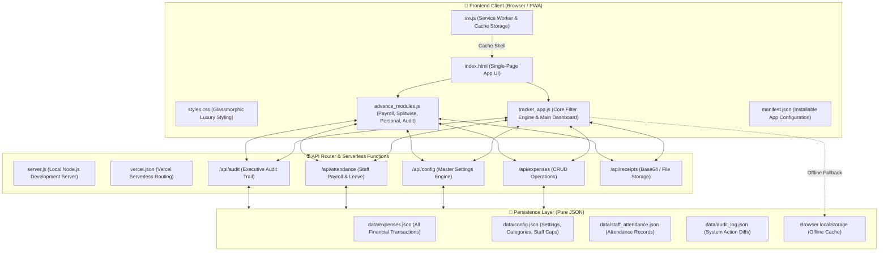
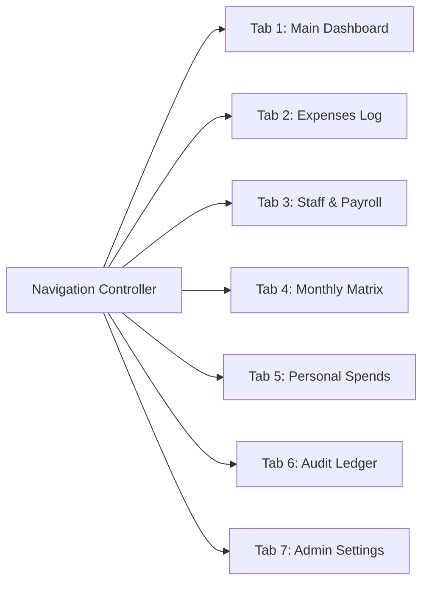

# HOMEEXPENSES · Complete Technical Implementation Plan & System Architecture

> **Document Version**: 4.0.0  
> **System Name**: HOMEEXPENSES Luxury Household Finance & Domestic Staff Payroll Command Center  
> **Target Production URL**: [https://homeexpenses-more.vercel.app/](https://homeexpenses-more.vercel.app/)  
> **Repository**: [palashmore/homeexpenses](https://github.com/palashmore/homeexpenses)  
> **Stack**: Vanilla ES6+ JavaScript, Tailwind CSS (JIT CDN), FontAwesome 6, Chart.js, SheetJS, Node.js HTTP/Express Serverless API, Dual-Storage JSON Persistence.

---

## 1. Executive Project Overview

### 1.1 Problem Statement
Modern household financial management often fails because:
1. **Commingled Spends**: Personal discretionary expenses (Swiggy, Zomato, personal shopping) get mixed into household utilities (groceries, maid, cook, electricity), distorting the actual household burn rate.
2. **Reimbursement Friction**: In two-earner couples where one partner pays upfront and the other reimburses (e.g., Palash covers 100% of Pallavi's out-of-pocket household expenses), manual calculations create friction.
3. **Domestic Staff Payroll Errors**: Maids and cooks have non-calendar billing cycles (e.g., 21st to 20th or 30th to 29th) with specific allowed paid leave quotas before daily deductions apply.
4. **Heavy Database Dependencies**: Traditional solutions require external SQL/NoSQL setups, connection pooling, migrations, and costly hosting tiers that fail when offline or unmaintained.

### 1.2 Solution Philosophy
HOMEEXPENSES solves this with a **zero-database-dependency**, **pure JSON + reactive client-side architecture** that runs identically:
- **Locally**: Via a standalone Node.js server (`server.js`) reading/writing to `data/*.json`.
- **On Serverless Clouds (Vercel)**: Utilizing serverless API routes (`/api/*`), `/tmp` fallback storage, and optional cloud storage sync.
- **Offline / Mobile (PWA)**: Using `localStorage` caching and a Service Worker (`sw.js`) so the interface opens instantly even with zero network connectivity.

---

## 2. System Architecture & Component Map



### 2.1 File Directory Structure
```
household-expense-tracker/
├── api/                           # Vercel Serverless Functions
│   ├── _db.js                     # Unified JSON file reader/writer (handles local & /tmp fallback)
│   ├── _cloud_sync.js             # Optional cloud drive sync bridge
│   ├── attendance.js              # Staff attendance endpoints
│   ├── audit.js                   # Audit log ledger & Excel export endpoint
│   ├── auth.js                    # Admin auth / token validator
│   ├── config.js                  # Dynamic master configuration endpoint
│   ├── expenses.js                # Core expenses CRUD endpoint
│   ├── migrate.js                 # Data migration utility
│   └── receipts.js                # Receipt attachment handler
├── data/                          # Physical JSON persistence folder
│   ├── audit_log.json             # Immutable audit events and field diffs
│   ├── config.json                # Master system settings & custom categories
│   ├── expenses.json              # Primary expense and income ledger
│   └── staff_attendance.json      # Staff daily attendance matrix
├── advance_modules.js             # Advanced payroll, Splitwise, personal suite, audit
├── tracker_app.js                 # Main dashboard engine, filtering, Chart.js bridges
├── index.html                     # Responsive single-page application UI
├── styles.css                     # Custom glassmorphic styling & responsive utilities
├── server.js                      # Local Node.js HTTP server (port 8000)
├── sw.js                          # Progressive Web App Service Worker
├── manifest.json                  # PWA installation manifest
├── vercel.json                    # Vercel deployment & routing configuration
└── package.json                   # Project metadata and dependencies
```

---

## 3. Data Schema Specifications

### 3.1 `expenses.json` (Transaction Ledger)
Every financial transaction conforms to this JSON structure:
```json
{
  "id": "exp-1790486334762-r5h7",
  "date": "2026-09-27",
  "amount": 4500,
  "category": "Chef - Nilima Nikose",
  "paidBy": "Palash",
  "paidTo": "Nilima Nikose Chef",
  "vendor": "Nilima Nikose Chef",
  "paymentMethod": "Cash",
  "notes": "September salary adjusted with bonus",
  "description": "September salary adjusted with bonus",
  "billingCycle": "2026-09-30",
  "receipt": "data:image/png;base64,...",
  "receiptStatus": "Yes (Attached)",
  "splitBetween": "Household Expense (Palash Covers / Reimburses Pallavi 100%)",
  "isPersonal": false,
  "expenseType": "household",
  "createdAt": "2026-09-27T05:44:46.366Z",
  "updatedAt": "2026-09-27T11:35:45.215Z",
  "version": 23
}
```

#### Field Definition Table
| Field | Type | Description |
| :--- | :--- | :--- |
| `id` | String | Unique timestamp-prefixed ID (`exp-<timestamp>-<hash>`) |
| `date` | String | ISO Date string (`YYYY-MM-DD`) |
| `amount` | Number | Numeric amount in INR (₹) |
| `category` | String | Selected category (e.g. `Grocery & Vegetables`, `Food Delivery`) |
| `paidBy` | String | Family member who funded the payment (`Palash`, `Pallavi`) |
| `paidTo` / `vendor` | String | Payee or recipient name |
| `paymentMethod` | String | `UPI / GPay / PhonePe`, `Cash`, `Credit Card`, `Net Banking` |
| `splitBetween` | String | Allocation tag identifying reimbursement or personal ownership |
| `isPersonal` | Boolean | `true` if personal discretionary spend; `false` if household |
| `expenseType` | String | `'household'`, `'personal'`, or `'income'` |
| `receipt` | String | Optional base64 data URI or image URL |
| `version` | Number | Optimistic concurrency incrementor for audit tracking |

---

### 3.2 `config.json` (Master System Settings)
```json
{
  "monthlyBudgetLimit": 50000,
  "familyMembers": ["Palash", "Pallavi"],
  "categories": [
    { "id": "cat-1", "name": "Grocery & Vegetables", "type": "expense", "isDefault": true },
    { "id": "cat-2", "name": "Chef - Nilima Nikose", "type": "expense", "isDefault": true },
    { "id": "cat-3", "name": "Maid - Madhuri", "type": "expense", "isDefault": true },
    { "id": "cat-4", "name": "Electricity Bill", "type": "expense", "isDefault": true },
    { "id": "cat-5", "name": "Flat Maintenance", "type": "expense", "isDefault": true },
    { "id": "cat-6", "name": "Dish Bill (DTH)", "type": "expense", "isDefault": true },
    { "id": "cat-7", "name": "Wifi & Internet", "type": "expense", "isDefault": true },
    { "id": "cat-8", "name": "Food Delivery", "type": "expense", "isDefault": false },
    { "id": "cat-9", "name": "Shopping & Miscellaneous", "type": "expense", "isDefault": false },
    { "id": "cat-10", "name": "Accepted Payments (Income)", "type": "income", "isDefault": true }
  ],
  "recurringBills": [
    { "id": "rec-1", "name": "Electricity Bill", "approxAmount": 2800, "dueDay": 23, "active": true },
    { "id": "rec-2", "name": "Flat Maintenance", "approxAmount": 1500, "dueDay": 6, "active": true },
    { "id": "rec-3", "name": "Dish Bill (DTH)", "approxAmount": 300, "dueDay": 8, "active": true },
    { "id": "rec-4", "name": "Maid - Madhuri", "approxAmount": 800, "dueDay": 21, "active": true },
    { "id": "rec-5", "name": "Chef - Nilima Nikose", "approxAmount": 4500, "dueDay": 30, "active": true },
    { "id": "rec-6", "name": "Wifi & Internet", "approxAmount": 1000, "dueDay": 15, "active": true }
  ],
  "staffConfig": {
    "Chef - Nilima Nikose": {
      "baseSalary": 4500,
      "billingCycleDay": 30,
      "freeLeavesQuota": 4,
      "phone": "+91 98000 00000"
    },
    "Maid - Madhuri": {
      "baseSalary": 800,
      "billingCycleDay": 21,
      "freeLeavesQuota": 2,
      "phone": "+91 98000 00001"
    }
  }
}
```

---

### 3.3 `audit_log.json` (Audit Trail Ledger)
```json
{
  "id": "aud-1790538200112-ab3f",
  "timestamp": "2026-09-28T00:30:00.112Z",
  "action": "UPDATE_EXPENSE",
  "recordId": "exp-1790486334762-r5h7",
  "user": "Palash",
  "details": "Updated Nilima Nikose salary from ₹4,000 to ₹4,500",
  "before": { "amount": 4000 },
  "after": { "amount": 4500 },
  "clientIp": "127.0.0.1"
}
```

---

## 4. Mathematical Models & Business Rules

### 4.1 Household vs Personal Expense Segregation Formula
To guarantee that personal discretionary spends never contaminate household operational metrics:

$$\text{All Expenses} = E_{\text{household}} \cup E_{\text{personal}}$$

An expense item $i$ is classified as personal if:
$$\text{isPersonalExpense}(i) \iff \begin{cases}
i.\text{isPersonal} = \text{true} \\
\lor \; i.\text{expenseType} = \text{'personal'} \\
\lor \; \text{contains}(i.\text{splitBetween}, \text{"personal"}) \\
\lor \; \text{contains}(i.\text{splitBetween}, \text{"not reimbursed"}) \\
\lor \; i.\text{category} \in \{\text{"Food Delivery"}, \text{"Personal Expense"}\}
\end{cases}$$

#### Financial Metric Calculations
* **Household Total Spend ($S_{\text{household}}$)**:
  $$S_{\text{household}} = \sum_{i \in E_{\text{household}}} i.\text{amount}$$
* **Personal Total Spend ($S_{\text{personal}}$)**:
  $$S_{\text{personal}} = \sum_{i \in E_{\text{personal}}} i.\text{amount} = S_{\text{Palash}} + S_{\text{Pallavi}}$$
* **Combined Grand Total ($S_{\text{combined}}$)**:
  $$S_{\text{combined}} = S_{\text{household}} + S_{\text{personal}}$$
* **Main Dashboard KPI Card 1**: Strictly renders $S_{\text{household}}$ (e.g. ₹12,563), displaying $S_{\text{personal}}$ (₹1,459) and $S_{\text{combined}}$ (₹14,022) as secondary reference pills.
* **Daily Average Burn Rate ($B_{\text{daily}}$)**:
  $$B_{\text{daily}} = \left\lfloor \frac{S_{\text{household}}}{\text{Days in Selected Month}} \right\rfloor$$

---

### 4.2 Splitwise 100% Reimbursement Engine
The household follows an asymmetric settlement protocol:
- **Rule**: Palash covers 100% of all household expenses paid upfront by Pallavi.
- **Exclusion**: Personal spends by Pallavi are strictly excluded from reimbursement.
- **Settlement Formula**:
  $$\text{Reimbursement Due to Pallavi} = \sum_{i \in E_{\text{household}}, \, \text{paidBy}(i)=\text{'Pallavi'}} i.\text{amount} \;-\; \sum_{s \in E_{\text{settlements}}} s.\text{amount}$$

#### 1-Click Settle Up Action
Clicking **"Settle Up & Reimburse"**:
1. Creates an incoming payment credit record:
   ```json
   {
     "category": "Accepted Payments (Income)",
     "amount": NetDue,
     "paidBy": "Palash",
     "paidTo": "Pallavi",
     "notes": "Full monthly reimbursement settlement",
     "splitBetween": "Settlement Transfer (Palash to Pallavi)"
   }
   ```
2. Instantly updates the reactive state, driving pending balance to **₹0 (Fully Settled)**.

---

### 4.3 Domestic Staff Attendance & Deduction Engine

#### Billing Cycle Windows
- **Chef (Nilima Nikose)**: 30th of previous month to 29th of current month. Base salary: **₹4,500**. Paid leave quota: **4 days**.
- **Maid (Madhuri)**: 21st of previous month to 20th of current month. Base salary: **₹800**. Paid leave quota: **2 days**.

#### Deduction Calculation Algorithm
$$\text{Days in Cycle} = N_{\text{cycle}} \quad (28, 29, 30, \text{or } 31)$$
$$\text{Per-Day Wage} = \frac{\text{Base Salary}}{N_{\text{cycle}}}$$
$$\text{Excess Leaves} = \max(0, \; \text{Total Absences} - \text{Free Leaves Quota})$$
$$\text{Total Deductions} = \text{Excess Leaves} \times \text{Per-Day Wage}$$
$$\text{Net Payable Salary} = \max(0, \; \text{Base Salary} - \text{Total Deductions} + \text{Bonuses})$$

#### WhatsApp Voucher Generation
Generates a pre-formatted WhatsApp payment summary:
```text
*PAYMENT VOUCHER · Nilima Nikose (Chef)*
Cycle: 30 Aug 2026 – 29 Sep 2026
Base Salary: ₹4,500
Total Leaves: 5 (Allowed: 4, Excess: 1)
Deduction: -₹150 (1 day × ₹150/day)
------------------------------------
*Net Amount Paid: ₹4,350*
Status: ✅ Confirmed & Settled via GPay
```

---

### 4.4 Monthly Household Budget Guardrail
* **Budget Limit ($L_{\text{budget}}$)**: Default ₹50,000 (configurable via Admin Settings).
* **Budget Utilization ($U$)**:
  $$U = \min\left(100, \; \left\lfloor \frac{S_{\text{household}}}{L_{\text{budget}}} \times 100 \right\rfloor\right)$$
* **Guardrail Status Thresholds**:
  - $U < 75\%$: **On Track** (Emerald `#10b981`)
  - $75\% \le U < 90\%$: **Approaching Limit** (Amber `#f59e0b`)
  - $U \ge 90\%$: **Budget Alert / Exceeded** (Rose `#f43f5e`)

---

## 5. UI/UX Tabs & View Specifications



### 5.1 Tab 1: Main Dashboard (Command Center)
- **Top Scope Switcher**: Pill toggle `[ 🏠 Household Only (Default) ]` vs `[ 🌐 Combined (All) ]`.
- **10 Luxury Summary Metric Cards**:
  1. Total Household Expenses (with Personal & Combined reference pills).
  2. Total Inflow / Credits.
  3. Net Cash Flow (Surplus / Deficit badge).
  4. Daily Average Burn Rate.
  5. Highest Single Expense.
  6. Staff Payroll Summary (Madhuri & Nilima status).
  7. Grocery Spend Share (% of total).
  8. Recurring Utilities Due / Paid Counter.
  9. Month-over-Month (% change vs previous month).
  10. Active Filtered Record Count.
- **Visual Charts**:
  - *Where Your Money Goes*: Donut chart (strictly household categories in household scope).
  - *Expenses by Payer*: Donut chart showing Palash vs Pallavi funding share.
  - *6-Month Spending Trend*: Multi-bar trend chart.
  - *Payment Method Breakdown*: Distribution across UPI, Cash, Cards.
- **Top Outflows & Recent Activity Tables**: Ranked lists displaying category, vendor, amount, and quick-edit shortcuts.

### 5.2 Tab 2: Daily Expenses Log
- Filterable, searchable tabular list of all financial transactions.
- Quick action buttons: View Receipt, Edit Record, Delete with confirmation.
- 1-Click Excel Export (`.xlsx`) and Import module powered by SheetJS.

### 5.3 Tab 3: Domestic Staff Attendance & Payroll
- Switcher between **Nilima Nikose** and **Madhuri**.
- Interactive monthly grid calendar (Present, Absent, Paid Leave, Half Day).
- Auto-calculated attendance metrics: Total Days, Free Leaves Left, Deductions, Net Payable.
- 1-Click "Log Payroll Expense" and "Send WhatsApp Receipt" actions.

### 5.4 Tab 4: Household Spending Matrix
- Cross-tabulated pivot matrix displaying Family Members (rows) across Categories (columns).
- Computes horizontal totals per member and vertical totals per category.
- Strictly strips out personal discretionary spends in household view.

### 5.5 Tab 5: Personal Expenses Suite
- Dedicated space for Palash & Pallavi's personal spending.
- **Key KPIs**: Palash Total, Pallavi Total, Combined Personal Spend, and Personal vs Household Ratio (e.g. 10% Personal vs 90% Household).
- **Personal Category Donut & Comparison Matrix**: Analyzes personal food delivery, individual shopping, medicines.
- **Personal Transaction Ledger**: Dedicated table for personal records with an "Add Personal Expense" shortcut.

### 5.6 Tab 6: Executive Audit Ledger
- Complete tabular timeline of all CRUD operations and setting modifications.
- Explicit Before ➔ After field diffs (e.g. `amount: 4000 ➔ 4500`).
- Export audit trail to formatted Excel workbook.

### 5.7 Tab 7: Admin & Master Configuration
- **Zero-Friction Access**: Direct configuration without cumbersome password barriers.
- **Categories Manager**: Add new household categories with automatic reactive dashboard inclusion.
- **Family Members Manager**: Add or remove household members ("Paid By").
- **Recurring Bills Checklist Editor**: Set target thresholds and due dates.
- **Staff Payroll Settings**: Base salary, free leave quotas, and billing cycle days.
- **Household Budget Limit**: Configure monthly budget target.

---

## 6. API Endpoints & Request Contracts

| Method | Endpoint | Description | Request Body / Query Params |
| :--- | :--- | :--- | :--- |
| `GET` | `/api/expenses` | Fetch expenses | `?month=September&year=2026` |
| `POST` | `/api/expenses` | Create expense | Transaction object |
| `PUT` | `/api/expenses` | Update expense | Transaction object with `id` |
| `DELETE` | `/api/expenses` | Delete expense | `?id=exp-...` |
| `GET` | `/api/config` | Fetch master config | None |
| `POST` | `/api/config` | Update settings | Updated config object |
| `GET` | `/api/attendance` | Fetch staff attendance | `?staff=...&month=...` |
| `POST` | `/api/attendance` | Save staff attendance | Attendance state payload |
| `GET` | `/api/audit` | Fetch audit logs | `?format=json` or `?format=xlsx` |

---

## 7. Execution & Deployment Runbook

### 7.1 Local Development Environment
1. **Prerequisites**: Node.js v18+ installed.
2. **Install Dependencies**:
   ```bash
   npm install
   ```
3. **Start Local Server**:
   ```bash
   node server.js
   ```
4. **Access Application**:
   Navigate to `http://localhost:8000/` in Google Chrome, Microsoft Edge, or Safari.

### 7.2 Deploying to Vercel
1. Push changes to GitHub:
   ```bash
   git add -A
   git commit -m "Deploy latest build"
   git push origin main
   ```
2. In the Vercel dashboard:
   - Connect repository `palashmore/homeexpenses`.
   - Preset: **Other**.
   - Output Directory: `./`.
   - The deployment will automatically configure `/api/*` serverless routes as declared in `vercel.json`.

---

## 8. Data Integrity & Disaster Recovery Protocol
1. **Local Auto-Sync Cache**: All transaction data is cached to `localStorage` under `household_expenses_online_cache`.
2. **Offline Fallback**: If the server or internet disconnects, the app falls back to local cache, displaying an "Offline Mode" indicator.
3. **Automated Audit Logging**: Every mutation generates an entry in `data/audit_log.json` with timestamp, user, action, and full state diff.
4. **Excel Cold Backup**: Weekly or monthly multi-sheet backup via the "Export View" button preserves complete history in an open spreadsheet format.
